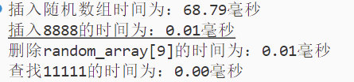

  算法分析与设计 
  210072.02.2025SP

## 第二次上机实验

- 姓名：PB22151823
- 学号：张一帆

### 一.实验题目
熟悉二叉搜索树以及常见的平衡树数据结构，对不同树搜索过程的时间复杂度有直观认识

### 二.实验目的
熟悉二叉搜索树以及常见的平衡树数据结构，对不同树搜索过程的时间复杂度有直观认识

### 三.实验环境
操作系统: windows 10
编程语言：python 3.7.0

### 四.实验内容
(1) 给定一个包含n个元素的实数数组，请构建一颗二叉搜索树，并实现节点的插入、删除和搜索过程；

(2) 给定一个包含n个元素 的实数数组，请构建一颗AVL树，并实现节点的插入、删除和搜索过程；

(3) 给定一个包含n个元素 的实数数组，请构建一颗红黑树，并实现节点的插入、删除和搜索过程；

(4) 给定一个包含n个元素 的实数数组，请构建一颗5阶-B树，并实现节点的插入、删除和搜索过程；

(5) 随机生成一个包含n个元素的实数数组，请比较在二叉搜索树、AVL树、红黑树、5阶-B树上进行相同节点插入、删除和搜索三个过程时间复杂度，并给出一份实验报告
### 五.对四棵树的正确性验证已经以及效率比较
**找助教验收时已经具体验证了正确性，由于验证正确性的操作过多，这里只列举一些典型的测试样例**
##### (1) **二叉搜索树**：
构造：

插入：(3020)

删除：(64869):

查找：(0,3020)

##### (2) **AVL**:

插入(70001,70002)

删除：（15260）

查找：(80887,80886)

##### (3) **红黑树**：

插入(18706):

删除(36937):

查找（100，65222）

##### (4) B树

**解释：这里表示头结点[10,21,37]有四个分支**
插入：(35)

**解释：插入35后分支满5，中间的结点上移**
删除：（39）

**解释：删除39后有一个分支里面的元素个数小于2这是不行的，要向旁边借，但是借不到，所以从上面拉下来一个合并**

查找(100,13)

##### 效率比较
假设我们让这四棵树都插入相同的随机数组(随机数组的规模是30000，数字的范围是[1,100000)在我的四个关于树的py文件中设置相同的随机种子)，都分别插入8888，删除random_ARRAY[9],查找11111；
二叉搜索树

AVL:

红黑树

B树

### 八.分析与总结
BST:

AVLT:

RBT:

BT:

